# 🛡️ Cyber Risk Scenario Generator

[](https://www.python.org/downloads/)
[](https://www.crewai.com/)
[](https://www.docker.com/)
[](https://opensource.org/licenses/MIT)

> **Agentic AI Bootcamp - Capstone Project**  
> A production-style multi-agent AI application that analyzes IT infrastructure documents and generates executive-level cyber risk reports.

---

## 🎯 Problem Statement

Security teams spend **weeks manually analyzing** IT environment documents to identify cyber risks. This project automates that process using **5 specialized AI agents** that collaboratively analyze documentation, research current threats, identify vulnerabilities, and produce prioritized risk reports—in minutes instead of weeks.

---

## ✨ Features

- **📄 Multi-Format Support**: Upload TXT, DOCX, or PDF documents
- **🤖 5 Specialized AI Agents**: Each with distinct expertise and responsibilities
- **🔍 Real-Time Threat Intelligence**: Integrates with CISA.gov, NVD, and web search
- **📊 Executive Reports**: CRITICAL and MONITOR risk categories with justification
- **🔬 LangSmith Observability**: Full LLM call tracing and debugging
- **🐳 Docker Ready**: One-command deployment with `docker compose up`

---

## 🏗️ Architecture

### System Architecture Diagram

```mermaid
flowchart TB
    subgraph UI["🖥️ Gradio Frontend (port 7860)"]
        Upload["📄 Document Upload"]
        Report["📊 Risk Report Display"]
    end
    
    subgraph Agents["🤖 CrewAI Multi-Agent System"]
        A1["1️⃣ Context Analyst"]
        A2["2️⃣ Threat Specialist"]
        A3["3️⃣ Vuln Researcher"]
        A4["4️⃣ Risk Architect"]
        A5["5️⃣ CISO"]
    end
    
    subgraph Tools["🔧 External Integrations"]
        T1["SerperDev<br/>Web Search"]
        T2["CISA.gov<br/>Threat Feed"]
        T3["NVD API<br/>CVE Database"]
    end
    
    subgraph Observability["📈 Observability"]
        LS["LangSmith Tracing"]
        Logs["Structured Logging"]
    end
    
    Upload --> A1
    A1 --> A2 --> A3 --> A4 --> A5
    A2 -.-> T2
    A3 -.-> T1
    A3 -.-> T3
    A5 --> Report
    Agents --> LS
```



### Agent Workflow & Prompt Design

The system uses **5 specialized agents** executing **sequentially**, where each agent's output feeds into the next:

| # | Agent | Role | Goal | Tools |
|---|-------|------|------|-------|
| 1 | **Context Analyst** | Operational Context Analyst | Extract tech stack, compliance needs, and business criticality | LLM only |
| 2 | **Threat Specialist** | Threat Intelligence Specialist | Identify active threat campaigns targeting the tech stack | CISA.gov Scraper |
| 3 | **Vuln Researcher** | Vulnerability Researcher | Find critical CVEs (2024-2026) for identified technologies | NVD API, SerperDev |
| 4 | **Risk Architect** | Cyber Risk Architect | Create 3 realistic attack scenarios with business impact | Synthesis |
| 5 | **CISO** | Chief Information Security Officer | Deliver executive summary with CRITICAL/MONITOR categories | Final Report |

**Design Rationale:**

- Single-responsibility agents for focused expertise
- Sequential execution ensures proper context propagation
- `max_iter=2` prevents infinite tool loops
- Temperature 0.2 for consistent, professional output

---

## 🚀 Quick Start

### Option 1: Docker Compose (Recommended)

```bash
# 1. Clone the repository
git clone https://github.com/ahmisal/cyber-risk-scenario-generator.git
cd cyber-risk-scenario-generator

# 2. Create .env file with your API keys
cp .env.example .env
# Edit .env and add your keys

# 3. Run with Docker Compose
docker compose up --build

# 4. Open browser to http://localhost:7860
```

### Option 2: Local Development

```bash
# 1. Create virtual environment
python -m venv venv
source venv/bin/activate  # Windows: venv\Scripts\activate

# 2. Install dependencies
pip install -r requirements.txt

# 3. Configure environment
cp .env.example .env
# Edit .env and add your API keys

# 4. Run the application
python app.py

# 5. Open browser to http://localhost:7860
```

---

## ⚙️ Configuration

### Required Environment Variables

Create a `.env` file with the following:

```ini
# Required
OPENAI_API_KEY=sk-proj-...

# Optional (enhances functionality)
SERPER_API_KEY=your_key_here
NVD_API_KEY=your_key_here

# LangSmith Observability (get key at https://smith.langchain.com)
LANGCHAIN_TRACING_V2=true
LANGCHAIN_ENDPOINT=https://api.smith.langchain.com
LANGCHAIN_API_KEY=lsv2_...
LANGCHAIN_PROJECT=cyber-risk-generator
```

---

## 📁 Project Structure

```
.
├── app.py                      # Unified application entry point
├── docker-compose.yml          # One-command Docker deployment
├── Dockerfile                  # Container configuration
├── requirements.txt            # Python dependencies
├── .env.example                # Environment template (no secrets)
│
├── app/                        # Backend application
│   ├── main.py                 # FastAPI entry point
│   ├── api/routes.py           # REST API endpoints
│   ├── agents/
│   │   ├── crew_agents.py      # 5 Agent definitions
│   │   └── orchestrator.py     # Agent workflow orchestration
│   ├── models/schemas.py       # Pydantic data models
│   └── observability/          # Logging configuration
│
├── ui/                         # Frontend
│   └── gradio_app.py           # Gradio web interface
│
└── tests/                      # Test suite
    ├── test_api.py             # API endpoint tests
    ├── test_agents.py          # Agent unit tests
    └── test_end_to_end.py      # Integration tests
```

---

## 🔬 Observability

This project integrates **LangSmith** for full LLM observability:

- **Trace Visualization**: See each agent's input/output
- **Latency Monitoring**: Track execution time per agent
- **Error Debugging**: Identify failures in agent chains
- **Cost Tracking**: Monitor token usage

To enable, set `LANGCHAIN_API_KEY` in your `.env` file.


---

## 🧪 Testing

```bash
# Run all tests
pytest

# Run with coverage report
pytest --cov=app tests/

# Run specific test file
pytest tests/test_api.py -v
```

---

## 📖 Usage Guide

1. **Open the Application**: Navigate to `http://localhost:7860`

2. **Enter Asset Name**: Provide a descriptive name (e.g., "Production Web Server")

3. **Upload Document**: Upload a file describing your IT environment:
   - Technologies and software versions
   - Infrastructure components
   - Network architecture
   - Compliance requirements

4. **Click "Analyze Risk"**: The 5-agent workflow executes (2-5 minutes)

5. **Review Report**: Executive-grade report with:
   - IT Environment Overview
   - Active Threat Campaigns
   - Identified Vulnerabilities (CVEs)
   - Attack Scenarios
   - **CRITICAL** and **MONITOR** Risk Categories

---

## 🛠️ Technologies

| Component | Technology |
|-----------|------------|
| **Agent Framework** | CrewAI |
| **LLM** | OpenAI GPT-4o-mini |
| **Backend** | FastAPI |
| **Frontend** | Gradio |
| **Observability** | LangSmith |
| **Container** | Docker |
| **Testing** | Pytest |

---

## 📝 API Reference

### Health Check

```
GET /api/v1/health
```

### Risk Analysis

```
POST /api/v1/analyze
Content-Type: multipart/form-data

Parameters:
- asset_name: string
- file: file (TXT, DOCX, PDF)
```

Interactive API docs available at: `http://localhost:8000/docs`

---

## 🐛 Troubleshooting

| Issue | Solution |
|-------|----------|
| `OPENAI_API_KEY not found` | Ensure `.env` file exists with valid key |
| `Analysis takes too long` | Normal execution is 2-5 minutes; check logs for progress |
| `LangSmith traces not appearing` | Verify `LANGCHAIN_API_KEY` is set correctly |
| `Docker build fails` | Ensure Docker Desktop is running |

---

## 📄 License

MIT License - Created for the Agentic AI Bootcamp Capstone Project.

---

## 👤 Author

**Ahmed Salman**  
Agentic AI Bootcamp - Capstone Project  
GitHub: [@ahmisal](https://github.com/ahmisal)
