# Cyber Risk Scenario Generator

A production-style agentic AI application that analyzes IT environment documents and generates comprehensive cyber risk reports using a multi-agent AI system.

## Overview

This application uses **CrewAI** to orchestrate 5 specialized AI agents that work together to:

1. Analyze IT environment documentation
2. Research current cyber threats
3. Identify vulnerabilities
4. Create risk scenarios
5. Generate prioritized risk reports

## Architecture

### System Architecture Diagram

```mermaid
flowchart TB
    subgraph UI["🖥️ Gradio Frontend (port 7860)"]
        Upload["📄 Document Upload"]
        Report["📊 Risk Report Display"]
    end
    
    subgraph API["⚡ FastAPI Backend (port 8000)"]
        Routes["/api/v1/analyze"]
        Extract["Text Extraction<br/>(PDF, DOCX, TXT)"]
    end
    
    subgraph Agents["🤖 CrewAI Multi-Agent System"]
        A1["1️⃣ Context Analyst"]
        A2["2️⃣ Threat Specialist"]
        A3["3️⃣ Vuln Researcher"]
        A4["4️⃣ Risk Architect"]
        A5["5️⃣ CISO"]
    end
    
    subgraph Tools["🔧 External Tool Integrations"]
        T1["SerperDev<br/>Web Search"]
        T2["CISA.gov<br/>Scraper"]
        T3["NVD API<br/>CVE Database"]
    end
    
    subgraph Observability["📈 Observability Stack"]
        LS["LangSmith<br/>LLM Tracing"]
        Logs["Structured<br/>Logging"]
    end
    
    Upload --> Routes --> Extract --> A1
    A1 --> A2 --> A3 --> A4 --> A5
    A2 -.-> T2
    A3 -.-> T1
    A3 -.-> T3
    A5 --> Report
    Agents --> LS
    API --> Logs
```



### Components

- **FastAPI Backend** (`app/`): RESTful API for processing risk analysis requests
- **Gradio Frontend** (`ui/`): User-friendly web interface for document upload and report viewing
- **CrewAI Agents** (`app/agents/`): Multi-agent system for cyber risk analysis
- **LangSmith Observability** (`app/observability/`): LLM tracing and structured logging

### Agent Workflow & Prompt Design

The system uses 5 specialized agents that execute **sequentially**, with each agent's output feeding into the next:

| Agent | Role | Goal | Tools |
|-------|------|------|-------|
| **1. Context Analyst** | Operational Context Analyst | Extract tech stack and business criticality from documentation | None (LLM only) |
| **2. Threat Specialist** | Threat Intelligence Specialist | Identify top threats for the technology stack | CISA.gov Scraper |
| **3. Vuln Researcher** | Vulnerability Researcher | Find critical CVEs (2024-2026) for the stack | NVD API, SerperDev |
| **4. Risk Architect** | Cyber Risk Architect | Create 3 realistic attack scenarios | None (synthesis) |
| **5. CISO** | Chief Information Security Officer | Deliver executive summary with CRITICAL/MONITOR categories | None (final report) |

**Prompt Design Rationale:**

- Each agent has a focused, single-responsibility goal
- Backstories establish expertise and constraints
- `max_iter=2` prevents infinite tool loops
- Sequential execution ensures proper context flow

### Project Structure

```
.
├── app/
│   ├── main.py                 # FastAPI application entry point
│   ├── api/
│   │   └── routes.py           # API endpoints
│   ├── agents/
│   │   ├── crew_agents.py      # Agent definitions
│   │   └── orchestrator.py     # Agent orchestration
│   ├── models/
│   │   └── schemas.py          # Pydantic models
│   ├── observability/
│   │   └── logging_conf.py     # Logging configuration
│   └── tools/                  # External tools (CrewAI tools)
├── ui/
│   └── gradio_app.py           # Gradio frontend
├── tests/
│   ├── test_api.py             # API endpoint tests
│   └── test_agents.py          # Agent orchestration tests
├── requirements.txt            # Python dependencies
├── Dockerfile                  # Docker configuration
├── .env.example               # Environment variables template
└── README.md                  # This file
```

## Setup

### Prerequisites

- Python 3.11+
- OpenAI API key
- (Optional) Serper API key for enhanced web search

### Installation

1. **Clone the repository** (or navigate to project directory)

2. **Create virtual environment**:

   ```bash
   python -m venv venv
   source venv/bin/activate  # On Windows: venv\Scripts\activate
   ```

3. **Install dependencies**:

   ```bash
   pip install -r requirements.txt
   ```

4. **Configure environment variables**:

   ```bash
   cp .env.example .env
   ```

   Edit `.env` and add your API keys:

   ```
   OPENAI_API_KEY=your_key_here
   SERPER_API_KEY=your_key_here  # Optional
   ```

## Running Locally

### Option 1: Run Backend and Frontend Separately

**Terminal 1 - Start FastAPI backend**:

```bash
uvicorn app.main:app --reload --port 8000
```

**Terminal 2 - Start Gradio frontend**:

```bash
python ui/gradio_app.py
```

Then open <http://localhost:7860> in your browser.

### Option 2: Run with Docker

```bash
# Build image
docker build -t cyber-risk-generator .

# Run container
docker run -p 8000:8000 -p 7860:7860 --env-file .env cyber-risk-generator
```

## Usage

1. **Open the Gradio interface** (<http://localhost:7860>)

2. **Enter Asset Name**: Provide a descriptive name for the asset being analyzed (e.g., "Production Web Server")

3. **Upload Document**: Upload a TXT, DOCX, or PDF file describing your IT environment, including:
   - Technologies and software versions
   - Infrastructure components
   - Network architecture
   - Security controls

4. **Click "Analyze Risk"**: The system will:
   - Extract text from your document
   - Execute the 5-agent workflow
   - Generate a comprehensive risk report

5. **Review Report**: The Markdown-formatted report includes:
   - IT Environment Overview (tech stack, compliance needs, business criticality)
   - Active Threat Campaigns (ransomware groups, threat actors)
   - Identified Vulnerabilities (CVEs 2023-2025, configuration weaknesses)
   - 5 Distinct Cyber Risk Scenarios
   - **CRITICAL** and **MONITOR** Risk Categories with justification

## Testing

Run tests with pytest:

```bash
# Run all tests
pytest

# Run with coverage
pytest --cov=app tests/

# Run specific test file
pytest tests/test_api.py
```

**Note**: Agent orchestration tests require `OPENAI_API_KEY` to be set in your environment.

## API Endpoints

### Health Check

```
GET /api/v1/health
```

### Risk Analysis

```
POST /api/v1/analyze
Content-Type: multipart/form-data

Parameters:
- asset_name: string (form field)
- file: file upload (TXT, DOCX, or PDF)
```

### API Documentation

Visit <http://localhost:8000/docs> for interactive API documentation.

## Configuration

### Environment Variables

- `OPENAI_API_KEY`: Required. Your OpenAI API key for GPT-4o-mini
- `SERPER_API_KEY`: Optional. For enhanced web search capabilities
- `API_URL`: Backend API URL (default: <http://localhost:8000/api/v1>)
- `LOG_LEVEL`: Logging level (default: INFO)

## Technologies Used

- **FastAPI**: Modern Python web framework
- **Gradio**: Rapid UI development
- **CrewAI**: Multi-agent orchestration framework
- **LangChain**: LLM integration
- **OpenAI GPT-4o-mini**: Language model
- **Pydantic**: Data validation
- **Pytest**: Testing framework

## Constraints & Design Decisions

- **LLM**: GPT-4o-mini with temperature=0.2 (matches reference implementation)
- **Execution**: Synchronous (simpler, easier to debug)
- **Tools**: Only CrewAI built-in tools (FileReadTool, SerperDevTool)
- **No Custom Tools**: Uses standard CrewAI tool ecosystem
- **No Notebooks**: Pure Python application structure
- **Agent Definitions**: Exactly match the reference implementation (roles, goals, backstories)
- **Task Descriptions**: Exactly match the reference implementation
- **Output Format**: Categorizes risks into CRITICAL and MONITOR lists (matches reference)

## Troubleshooting

### "OPENAI_API_KEY not found"

- Ensure `.env` file exists and contains your API key
- Or export the environment variable: `export OPENAI_API_KEY=your_key`

### "Could not connect to backend API"

- Ensure FastAPI server is running on port 8000
- Check that `API_URL` in `.env` matches your backend URL

### Analysis takes too long

- Agent execution typically takes 2-5 minutes
- Complex documents with many technologies may take longer
- Check logs for detailed execution progress

## License

This project is created for educational purposes as part of a bootcamp capstone project.
